# 4-Bit Arithmetic Logic Unit (ALU)

This project presents the design and implementation of a 4-bit Arithmetic Logic Unit (ALU) using fundamental digital logic ICs. The ALU performs arithmetic and logical operations and was implemented both in Proteus simulation and hardware on a breadboard.

---

## 1. Abstract

This project demonstrates the design of a 4-bit ALU using standard TTL logic ICs. The ALU performs addition, subtraction, logical operations (AND, OR, NOR), complement operations, increment/decrement, comparison, and counter functions.  

The system integrates ICs such as 7483 (Adder), 7486 (XOR), 7408 (AND), 7432 (OR), 7485 (Comparator), 74163 (Counter), and 4067 (16-channel MUX). The design was verified using Proteus simulation and validated through physical hardware implementation.

---

## 2. Introduction

A 4-bit Arithmetic Logic Unit (ALU) is a fundamental digital circuit responsible for performing arithmetic and logical operations on binary numbers. It serves as a core building block of a CPU and plays a vital role in digital processing systems.

This project integrates combinational and sequential circuits to design a fully functional multi-operation ALU.

---

## 3. Apparatus Used

- 5V DC Power Supply  
- Breadboard  
- Jumper Wires  
- LEDs  
- 7486 (XOR Gate)  
- 7408 (AND Gate)  
- 7432 (OR Gate)  
- 7404 (NOT Gate)  
- 7483 (4-bit Full Adder)  
- 74157 (Quad 2-to-1 MUX)  
- 7485 (4-bit Comparator)  
- 74163 (4-bit Counter)  
- 4067 (16-Channel Multiplexer)  
- Proteus Software  

---

## 4. ALU Operations

The ALU performs the following operations:

1. Addition  
2. Subtraction  
3. Bitwise OR  
4. Bitwise AND  
5. Bitwise NOR  
6. 1’s Complement  
7. 2’s Complement  
8. Increment  
9. Decrement  
10. Counter  
11. Comparator  
12. Load A  

---

## 5. Operation Selection Table

| Select Lines | Operation |
|--------------|------------|
| 0000 | Adder / Subtractor |
| 0001 | Bitwise OR |
| 0010 | Bitwise AND |
| 0011 | Bitwise NOR |
| 0100 | 1’s Complement |
| 0101 | 2’s Complement |
| 0110 | Increment |
| 0111 | Decrement |
| 1000 | Comparator |
| 1001 | Counter |
| 1010–1111 | Don’t Care |

---

## 6. System Design Overview

### Adder / Subtractor
Implemented using 7483 ripple carry adder. XOR gates control subtraction via carry input.

### Logical Operations
- AND → 7408  
- OR → 7432  
- NOR → Implemented using logic gates  

### Complement Operations
- 1’s Complement → 7404 (NOT)  
- 2’s Complement → Adder with binary 0001  

### Comparator
- 7485 IC used to compare A and B  

### Counter
- 74163 synchronous counter  

### Output Selection
- 4067 (16-to-1 Multiplexer) used to select final 4-bit output  

---

## 7. Images and Circuit Diagrams

## 7.1 Circuit Diagram

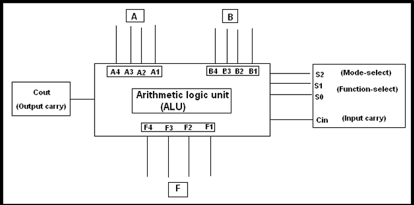

---

## 7.2 Adder / Subtractor

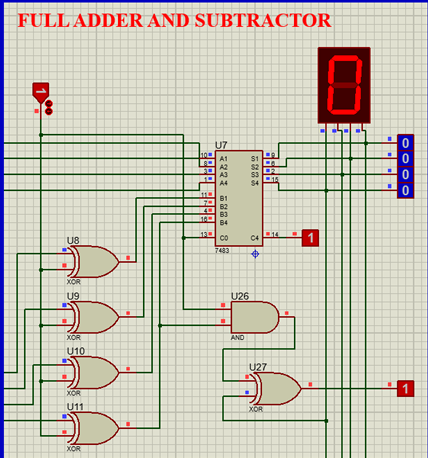

---

## 7.3 Bitwise OR

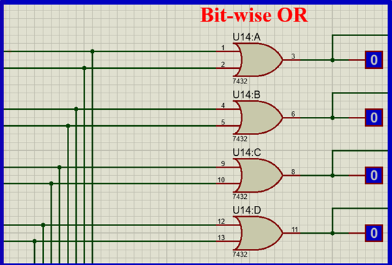

---

## 7.4 Bitwise AND

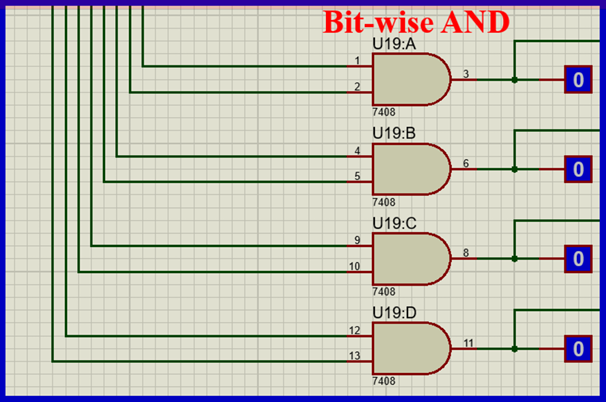

---

## 7.5 Bitwise NOR

---

## 7.6 Multiplexer

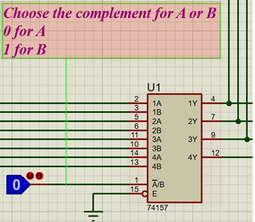

---

## 7.7 1’s and 2’s Complement

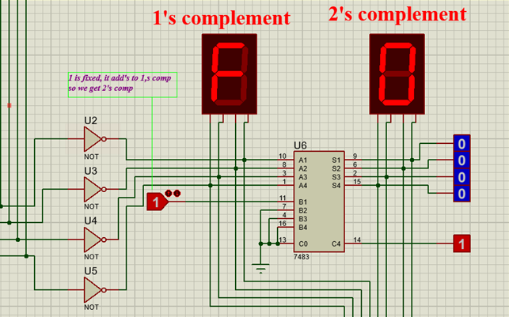

---

## 7.8 Increment Operation

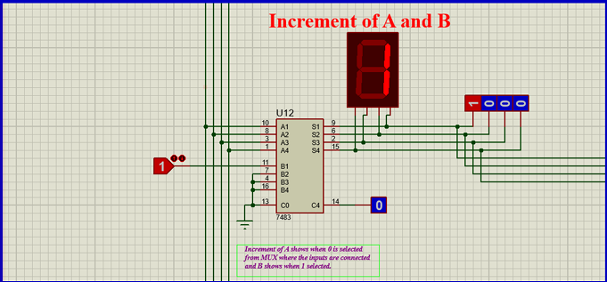

---

## 7.9 Decrement Operation

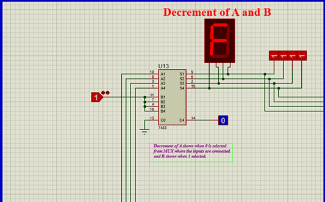

---

## 7.10 Comparator

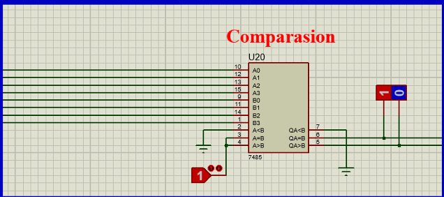

---

## 7.11 Counter / Load A

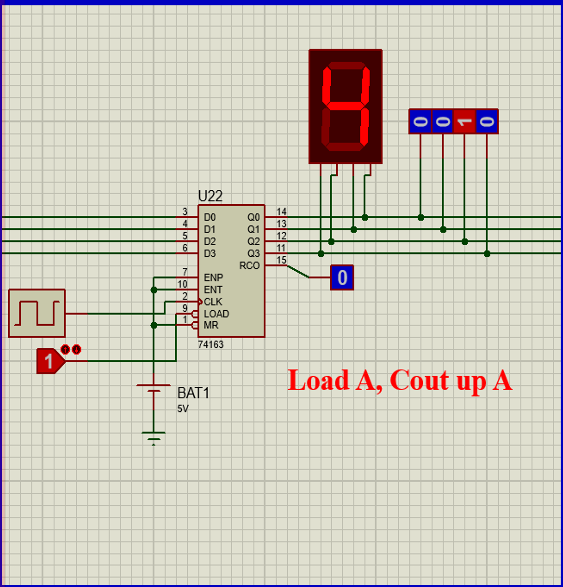

---

## 7.12 Output Selection using 4067 MUX

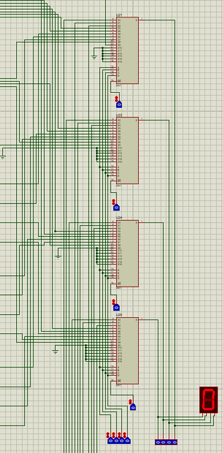

---

## 7.13 Final Circuit (Proteus Simulation)

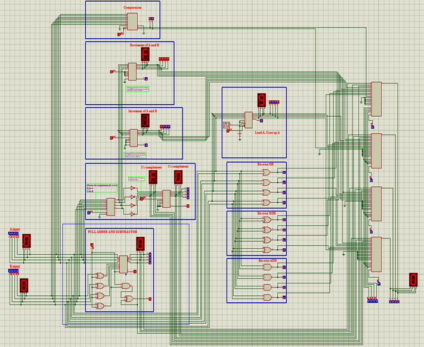

---

## 8. Conclusion

The 4-bit ALU was successfully designed using standard logic ICs and implemented both in simulation and hardware. The multiplexer-based selection enabled efficient switching among multiple operations. The integration of arithmetic, logical, comparison, and counting functions demonstrates modular digital system design.  

This project strengthened understanding of combinational and sequential circuit integration and practical hardware implementation.

---

## Team Members

- Muhammad Bilal Chaudhry  
- Muhammad Fahad Ali  
- Muhammad Muzzamil  

